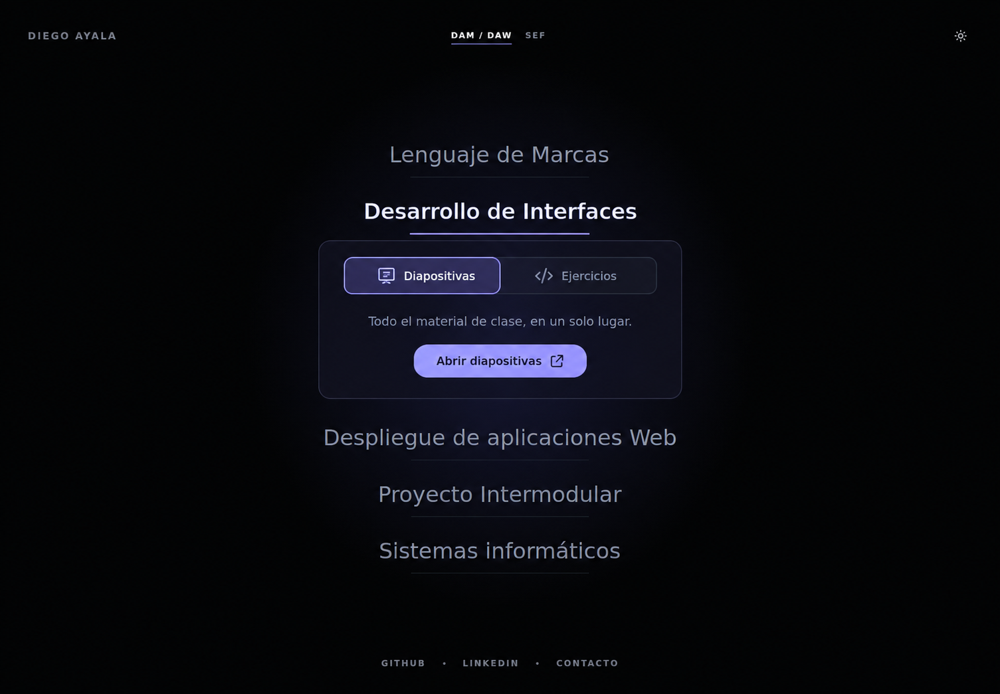
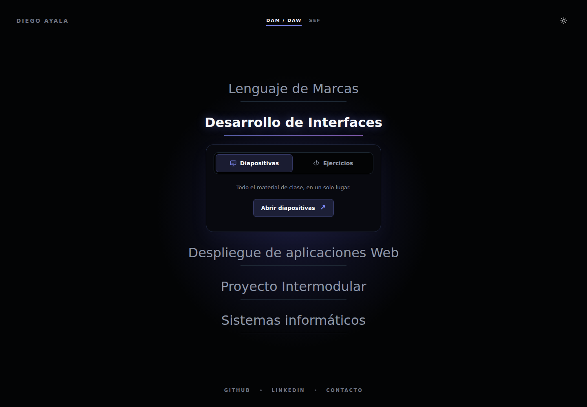
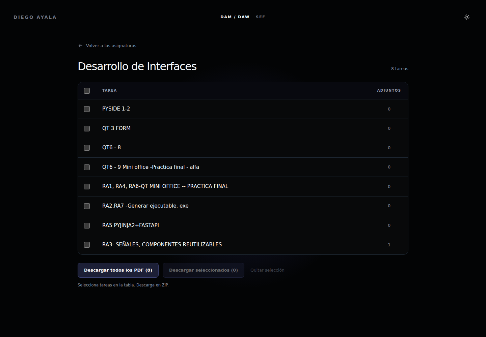
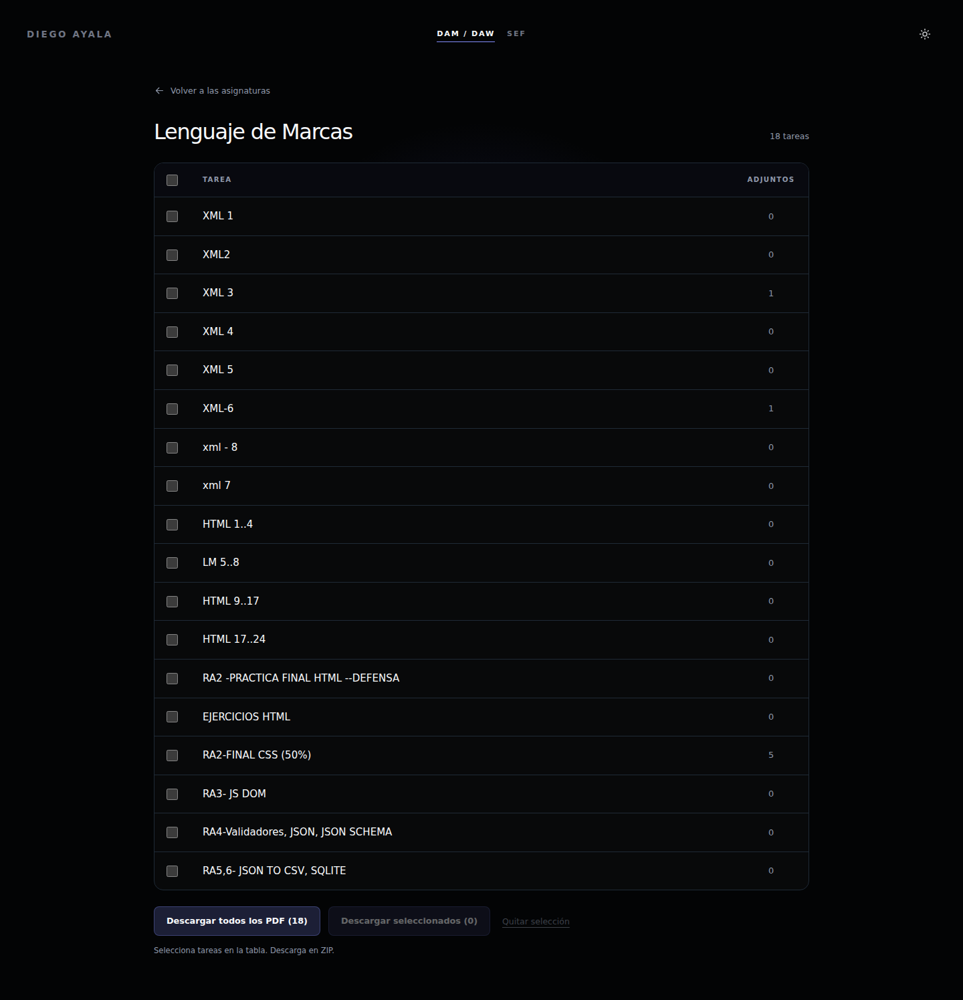
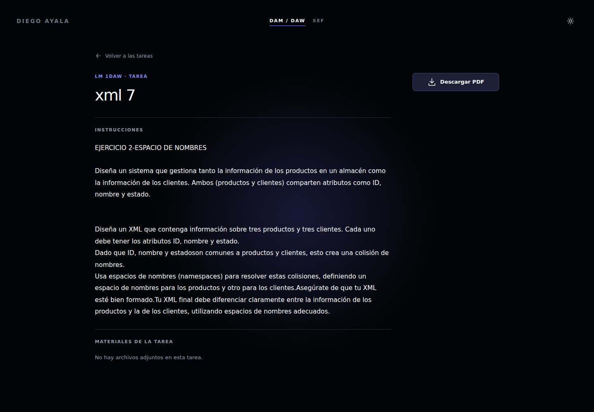
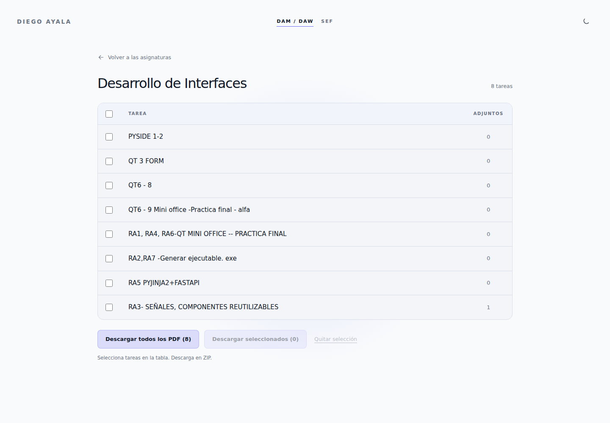
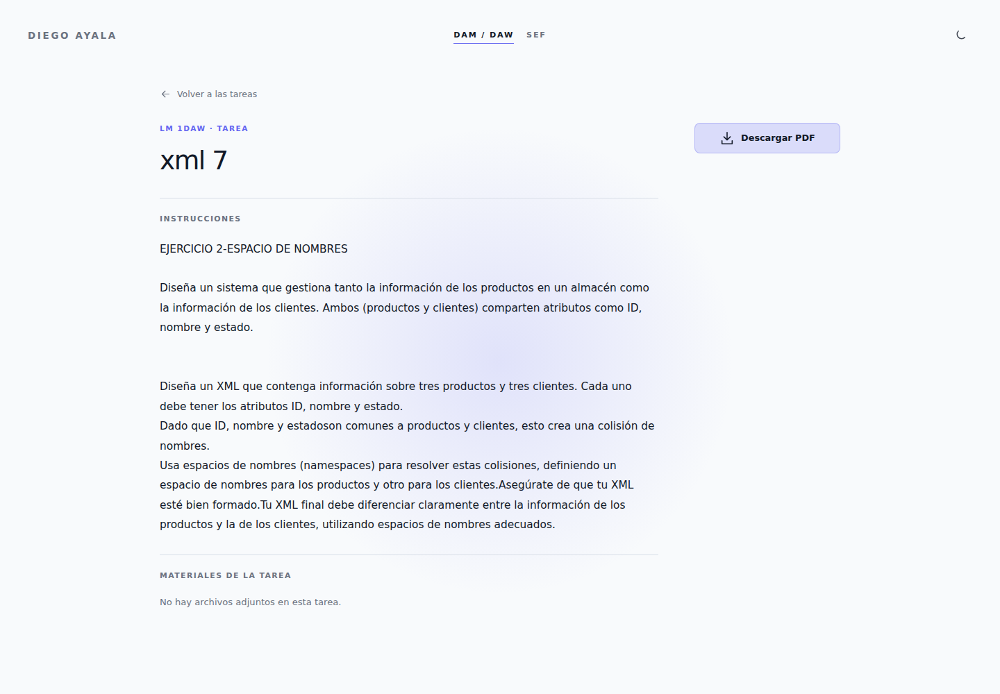

# Selector de material por asignatura

Propuesta: desplegar las pestañas «Diapositivas» y «Ejercicios» bajo la asignatura seleccionada. Cada apertura empieza en «Diapositivas». Los ejercicios reutilizan los HTML y las descargas existentes con el estilo de la portada. Se toma únicamente el último curso disponible de cada asignatura como base, sin mostrar etiquetas ni un selector de curso.

Los cuatro listados y las 41 tareas comparten con la portada la cabecera «Diego Ayala», la navegación DAM/DAW y SEF, la tipografía, los acentos violeta y el selector de tema. El modo claro u oscuro se conserva al navegar. Las tablas, los botones y los adjuntos siguen el mismo estilo. La impresión mantiene el fondo blanco y los estilos originales.

Los listados muestran directamente la tabla con selección de PDF, «Tarea» y «Adjuntos». Los botones de descarga y «Quitar selección» aparecen debajo de la tabla. Se retiran el bloque introductorio, el buscador y los controles de ordenación y filtrado, las columnas de creación, entrega prevista, imágenes y estado, y el pie de todas las páginas de ejercicios. Las tareas aparecen en orden cronológico sin necesitar JavaScript.

El menú incluye Programación de Servicios y Procesos, con sus materiales pendientes de enlazar. Los enlaces de contacto de DAM/DAW y SEF apuntan a `diego.ayala@colegiomiralmonte.es`.

En cada tarea, el lateral contiene únicamente el botón «Descargar PDF». Se eliminan el panel de información con fechas, estado y puntuación, y la nota bajo el botón.

El panel «Sobre esta tarea» también se elimina de los PDF descargables. El importador los regenera desde los HTML públicos antes de preparar los ZIP completos y las descargas de seleccionados, manteniendo enunciados, imágenes y materiales.

Lenguaje de Marcas abre 18 tareas publicadas seleccionadas de `LM 1DAW` del último curso disponible, 2025–2026. Desarrollo de Interfaces contiene 8 tareas. Los exámenes ocultos y las tareas retiradas se excluyen de la carpeta pública, incluidos sus PDF, adjuntos y descargas en ZIP. Los originales se conservan en el backup.

## Concepto con imagegen

Generado con la herramienta integrada de imagegen a partir de una captura de la web original.



## Implementación













## Prompt utilizado

```text
Use case: ui-mockup
Asset type: high fidelity desktop website proposal, based on the attached screenshot.
Primary request: edit the reference website screenshot to show the proposed inline subject resource selector after clicking “Desarrollo de Interfaces”. Preserve the existing minimalist academic website and show a realistic implementable change.
Input image: existing site screenshot is the edit target and visual reference. Preserve header “DIEGO AYALA”, centered “DAM / DAW” and “SEF”, sun icon, footer links, nearly black background, subtle central indigo glow, clean system sans-serif typography, single centered list of five subjects, ample negative space.
Change: “Desarrollo de Interfaces” becomes the selected subject in bright white and a slightly heavier weight, with a thin violet underline. Directly underneath it, expand a restrained centered panel, width about 430px, rounded corners, barely visible charcoal-violet background and hairline border. The remaining subjects move down naturally; no overlap.
Panel content: at top a compact two-tab segmented control with a small outlined slide icon plus exact text “Diapositivas” as the selected violet-tinted tab and a small outlined code icon plus exact text “Ejercicios” as the inactive muted tab. Under the tabs, centered muted text exactly “Todo el material de clase, en un solo lugar.” Then a compact soft-violet primary action with exact text “Abrir diapositivas” and an external-link arrow.
Preserve these five subject names in this order: “Lenguaje de Marcas”, “Desarrollo de Interfaces”, “Despliegue de aplicaciones Web”, “Proyecto Intermodular”, “Sistemas informáticos”. The selected item is the second. Do not add a page heading, sidebar, cards for fake exercises, course counts, badges, brands, illustrations, annotations, browser chrome, or explanations. Show one desktop viewport, wide landscape composition, sharp legible Spanish text. Treat this as a website screenshot, not a presentation board.
```
